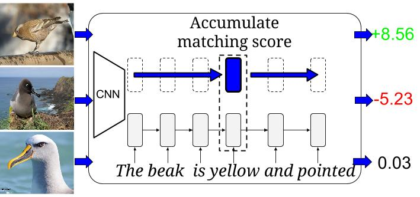

###<a href="http://arxiv.org/abs/1605.05395">Learning Deep Representations of Fine-grained Visual Descriptions</a>
Scott Reed, Zeynep Akata, Honglak Lee, Bernt Schiele



#####How to train a char-CNN-RNN model:

1. Download the [birds](https://drive.google.com/open?id=0B0ywwgffWnLLZW9uVHNjb2JmNlE)
 and [flowers](https://drive.google.com/open?id=0B0ywwgffWnLLcms2WWJQRFNSWXM) data.
2. Modify the training script (e.g. `train_cub_hybrid.sh` for birds) to point to your data directory.
3. Run the training script: `./train_cub_hybrid.sh`

#####How to evaluate:

1. Train a model (see above).
2. Modify the eval bash script (e.g. `eval_cub_cls.sh` for birds) to point to your saved checkpoint.
3. Run the eval script: `./eval_cub_cls.sh`

#####Pretrained models:

* [Char-CNN-RNN for birds](https://drive.google.com/open?id=0B0ywwgffWnLLYUNVWVV5Sm1xcWc)
* [Char-CNN-RNN for flowers](https://drive.google.com/open?id=0B0ywwgffWnLLV205RXF4Y2hFY1E)

#####Citation

If you find this work useful, please cite as follows:

```
@inproceedings{reed2016learning, 	
 title = {Learning Deep Representations of Fine-Grained Visual Descriptions,
 booktitle = {IEEE Computer Vision and Pattern Recognition},
 year = {2016},
 author = {Scott Reed and Zeynep Akata and Bernt Schiele and Honglak Lee},
}
```
